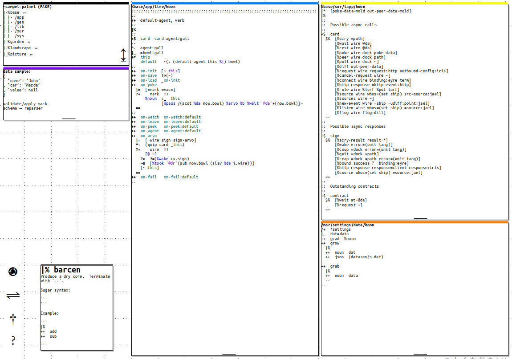

#   The Urbit Developer Experience

Urbit has clean minimalist aesthetics for the end user, as well as a solid visual reputation among its casual acquaintances.  The developer experience, however, is ad hoc and cobbled together from disparate Unix tools by each new developer.

In short, to run Urbit feels like Apple while to code Urbit feels like Linux.  (This is a sensory judgment, not about the code details.)  **How do we upgrade the developer experience to make it feel sexy to program on Mars?**

The goal must be to offer a space-age developer experience.  It needs to feel good to write code for Urbit.  Riffing on Jonathan Blow's ending talk at Assembly 2021, quality of life is king.

Æsthetics, affordances, integrations.

##  What's Wrong

Hoon was motivated by a need to subordinate the detail of Turing-complete but hyperminimalist Nock.  Writing Hoon is not unlike attempting C-level systems programming in APL.

While some programming affordances exist, the lion's share of effort has gone (justly) into language and platform development rather than programmer affordances.  Aspects of the language and Arvo kernel sometimes feel unmotivated, and it is frequently unclear if they are necessary or contingent entailments of Urbit.  Increasing developer familiarity with idiomatic constructions will enable better presentation, manipulation, and updates of code.

The current developer experience is largely architected around text-editor-level IDEs and tools such as `vim`, Atom, and VSCode, coupled with ample use of background terminal sessions.  While clearly adequate, this is a scrappy Unix-like experience while the gold standard is Apple (or better, [BeOS](https://www.hackneys.com/docs/in-the-beginning-was-the-command-line.pdf)).

##  And How to Fix It

Again and again, the best user experiences are not fully configurable, but opinionated.  Consider Apple's XCode, which supplanted competitors not only due to its authoritative sanction but also its clean interface and tight integration.

For instance, the gold standard for Python code linting is not the [`flake8`](https://pypi.org/project/flake8/) tool with its configurable options.  The gold standard for Python is [_Black_](https://pypi.org/project/black/).  Black is a fully opinionated tool for code linting that offers no options.  You either accept its superior formatting or you go your own way.

There needs to be One Right Way to develop on Mars.  Not for code style, but for tooling:  one clearly superior set of tooling and integrations.

##  Æsthetics

At Assembly, participants received a Midori MD Notebook from Japan.  The clean minimalist lines go beyond even a Moleskine or Leuchtterm 1917 notebook in promise.  It feels good to hold and it feels good to use.  It beguiles.

This is what programming for Urbit should feel like.

The interface itself should feel like writing with a good pen on good paper.  There should be plenty of whitespace to not crowd the developer.  Rather than options, the interface should be aesthetically opinionated:  lean, clean, functional.

I propose creating an integrated development environment for Urbit code-named Ockham.  I attach an evocative mockup of what Ockham could look like modulo a designer's eye.  While I do not envision Ockham as being written in Hoon or based in the browser, it should be a cross-platform indispensable tool for the Urbit developer.

The optimal developer experience feels like working with index cards and paper on a desk.  A modestly-composable interface will allow disposition of necessary items and tools without escaping into the horror of MS Ribbons.  Backend interfaces will directly connect to a running ship and permit direct interactions with Clay and Gall agents.  Urbit has sound reasons to use cores, doors, etc.:  exploit these features to make development shine.

The basic interface will permit a narrow reference column at left and two wide working columns in the middle.  (These are 80 characters wide and no wider.)  Nominally the wide columns are for code, but some other tools will display there as well.  Ultimately, the user interface itself should encourage clean code practices.

For instance, it is common when creating Gall agents to need a mark, a structure file, and an agent open simultaneously.  Add to these a tool for quickly pulling arms and applying marks, and one has a fully-featured IDE that easily beats the cobbled-together `tmux` screens common today.

##  Affordances

Developer affordances such as tab-completion are slowly coming into being.  Ockham should unite all current standards of practice and supersede them.

The built-in developer tools include standard features such as:

- syntax highlighting for Hoon
- quick core search & lookup
- online help and rune child completion assistance
- switch between wide/tall forms of runic expressions
- refactoring support
- like Obsidian, multiple windows should be preferred to extensive tab usage
- ability to sync long cells together to scroll in tandem

(I can see an argument for including options for `vim`/`emacs` key binding options but do not have a strong opinion on this yet.)

They also provide appropriate data structure tools:

- tree visualizer for cell structure and addressing
- JSON conversion to Hoon tree representation (general conversion tools)
- JSON schema-to-reparser generation
- mark checker (via multiple paths)

The Urbit IDE is optimized for building Hoon tools (rather than, say, runtime and jet development).

##  Integrations

The Ockham front-end can connect to a ship, either livenet or fakezod, and perform Clay and Gall operations.  (I am as yet undecided on whether a terminal interface should be included in this IDE.)

A number of convenience tools address common working idioms and developer grievances:

- sandboxing for simulating arm behavior against mocked-up data
- Gall agent factory
- Gall+Eyre endpoint/internal state/poke comparison tool

Ockham will also run tightly integrated with its own backend ship (either a livenet planet or comet) for sandboxing quick calculations.

##  Inspirations

- [Are.na Board](https://www.are.na/neal-davis/ockham-ide)

- [Aaron Hsu,  “Paper is Dead, Long Live Paper Programming!”](https://www.sacrideo.us/paper-is-dead-long-live-paper-programming/)
- [Aaron Hsu, “Writing Code to Be Spoken”](https://www.sacrideo.us/writing-code-to-be-spoken/)
- [Matz, “Treating Code as an Essay” in _Beautiful Code_](http://libgen.rs/book/index.php?md5=6DA426C76EE6E1983F3D42D825D21235)
